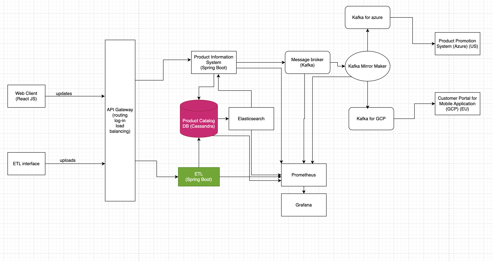

# Product Information System Loader

### A microservice for uploading products' information.

This application represents the box marked green in the architecture diagram 

The information of `Products` in a real life project could come from inventory details service or basic file uploads. Here I have used `https://dummyjson.com/products` endpoint to fetch some dummy products.

The products provided in this endpoint have lots of fields, all relevant to a product but not so relevant for our assignment. So, this application deals with sanitizing that data as well.

Eg: 

You can provide limit of products to be fetched in this dummy endpoint. In a real life project again, we expect millions of products and need to cater for such big data. Here for this assignment though I have loaded 10 records. However it is configurable in `application.properties`. 

The database chosen is Cassandra keeping in mind amount of updates we shall be doing. For the cassandra db, for this assignment, I have used `datastax` `astra DB` free version. In a real life project we should use cloud of our own choice and configure the DB using IaC. To be able to connect to this DB, we need some credentials and secure-bundle.zip, once you have them you can run the application. 

### How to run the application

`mvn spring-boot:run` 

At the end of it, this is what the DB has:

